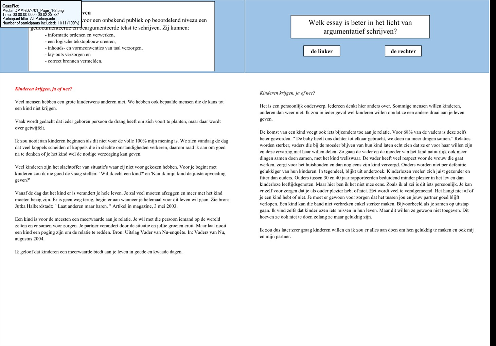
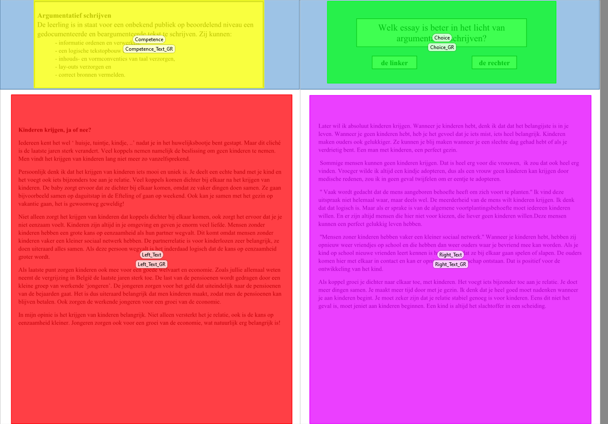

```{r setup, include=FALSE}
options(htmltools.dir.version = FALSE)
```
name: introduction
class: center,inverse, bottom
background-image: url(sharon-mccutcheon-NeRKgBUUDjM-unsplash.jpg)
background-size: contain

# Introduction


```{r ,warning=F,message=F,echo=F}
library(dplyr)
library(knitr)
library(tidyr)
library(purrr)
library(ggplot2)
library(bayesplot)
library(stringr)
library(kableExtra)

load(file = "data/M1_Fit")
load(file = "data/M2a_Fit")
load(file = "data/M2b_Fit")
load(file = "data/M3_Fit")
```

---

## Judging 'argumentative texts'




---

## Two types of processes?

<http://www.youtube.com/watch?v=z2f_Ue45KWM>

<iframe
    width="640"
    height="480"
    src="https://www.youtube.com/embed/z2f_Ue45KWM"
    frameborder="0"
    allow="autoplay; encrypted-media"
    allowfullscreen
>
</iframe>

---

## So...

Gaze duration data might result from different cognitive processes:

$\rightarrow$ shorter visits in both texts (reading for building a first 'mental model' / scanning) 

$\rightarrow$ long visit in one of both texts (reading for text comprehension)

---
## But...

How to statistically model the resulting duration data?

... without **categorisation** (setting tresholds to distinguish scanning from text comprehension)

... and avoiding **aggregation**

Goal of this research:
> build and test statistical models that acknowledge the data generating cognitive processes and that do not make use of 'trimming', 'setting tresholds' or 'aggregation'

---
class: inverse, center
background-image: url(wyron-a-Lhb1DyyNr7U-unsplash.jpg)
background-size: contain
# Methodology

---

## Procedure

- 26 high school teachers (Dutch) voluntary participated

- each did 10 comparisons of 2 argumentative texts from 10th graders

- 3 sets of comparisons with random allocation of judges to one of the sets

- Tobii TX300 dark pupil eye-tracker with a 23-inch TFT monitor (max. resolution of 1920 x 1080 pixels)

- data sampled binocularly at 300 Hz 

---

## AOI's


---

## The data

```{r, echo = F, warning = F}
load("data/Durations_Texts.Rdata")
Durations_Texts$Partic <- Durations_Texts$Participant_RecordingNUM
Durations_Texts$Compar <- Durations_Texts$MediaName
Durations_Texts$Dur_Seconds <- Durations_Texts$GazeEventDurationTotSeconds
Durations_Texts$Dur_Log <- Durations_Texts$GazeEventDurationTotLog

library(DT)
Durations_Texts %>% 
  select(Partic,Compar,AOI_Type,Dur_Seconds,Dur_Log) %>% 
  DT::datatable(
  fillContainer = FALSE, 
  options = list(pageLength = 8,
                 columnDefs = list(list(
                    targets = 2,
                    render = JS(
                    "function(data, type, row, meta) {",
                    "return type === 'display' && data.length > 5 ?",
                    "'<span title=\"' + data + '\">' + data.substr(0, 6) + '...</span>' :                        data;",
                    "}")
                    )
                  )), 
    callback = JS('table.page(1).draw(false);')
) %>% formatRound(columns=c('Dur_Log'), digits=3)
```

---
## Statistical model 1 

Simple <span style="color: rgb(249, 38, 114)">mixed effects model </span>

= 'Gaze Event duration' of AOI visits are nested within the combination of juges and comparisons

$$y_{i(jk)}=\beta_{0} + \mu_{0j} + \nu_{0k}  + \epsilon_{i(jk)}$$

with:

- $y_{i(jk)}$ = gaze event duration of a visit to an AOI (text);
- $\beta_0$ = the intercept (overall average duration);
- $\mu_{0j}$ = unique effect of judge $j$;
- $\nu_{0k}$ = unique effect of comparison $k$;
- $\epsilon_{i(jk)}$ = residual;

---

## Statistical model 2: 

first mixed effects <span style="color: rgb(249, 38, 114)">finite mixture </span> model


Model1 **+ assuming two data generating processes + gaze event durations from 'text comprehension' differ for judges and comparisons**

$$\begin{aligned}
y_{i(jk)} = & \theta     \times (\beta_{1} + \epsilon_{1i(jk)}) + \\
            & (1-\theta) \times (\beta_{2} + \mu_{2j} + \nu_{2k} + \epsilon_{2i(jk)})
\end{aligned}$$


with:

- $\beta_1$ = intercept 1, overall average duration process 1 $\rightarrow$ 'scanning';
- $\beta_2$ = intercept 2, overall average duration process 2 $\rightarrow$ 'text comprehension reading';
- $\mu_{2j}$ = unique effect of judge $j$ on 'text comprehension reading';
- $\nu_{2k}$ = unique effect of comparison $k$ on 'text comprehension reading';
- $\epsilon_{1i(jk)}$ & $\epsilon_{2i(jk)}$ = residuals;
- $\theta$ = mixing proportion (weight)

---
## Statistical model 3

Model 1 **+ assuming two data generating processes + gaze event durations from 'scanning' differ for judges and comparisons**

$$
\begin{aligned}
y_{i(jk)} = & \theta     \times (\beta_{1} + \mu_{1j} + \nu_{1k} + \epsilon_{1i(jk)}) + \\
            & (1-\theta) \times (\beta_{2} + \epsilon_{2i(jk)})
\end{aligned}
$$

with:

- $\beta_1$ = intercept 1, overall average duration process 1 $\rightarrow$ 'scanning';
- $\beta_2$ = intercept 2, overall average duration process 2 $\rightarrow$ 'text comprehension reading';
- $\mu_{1j}$ = unique effect of judge $j$ on 'scanning';
- $\nu_{1k}$ = unique effect of comparison $k$ on 'scanning';
- $\epsilon_{1i(jk)}$ & $\epsilon_{2i(jk)}$ = residuals;
- $\theta$ = mixing proportion (weight)

---

## Statistical model 4

Model 1 + two data generating processes + **gaze event durations from both processes differ for judges and comparisons**


$$
\begin{aligned}
y_{i(jk)}= & \theta     \times (\beta_{1} + \mu_{1j} + \nu_{1k} + \epsilon_{1i(jk)}) + \\
           & (1-\theta) \times (\beta_{2} + \mu_{2j} + \nu_{2k} + \epsilon_{2i(jk)})
\end{aligned}
$$

With:

- $\beta_1$ = intercept 1, overall average duration process 1 $\rightarrow$ 'scanning';
- $\beta_2$ = intercept 2, overall average duration process 2 $\rightarrow$ 'text comprehension reading';
- $\mu_{1j}$ & $\mu_{2j}$ = unique effect of judge $j$ on 'scanning' & 'text comprehension reading';
- $\nu_{1k}$ & $\nu_{2k}$ = unique effect of comparison $k$ on 'scanning' & 'text comprehension reading';
- $\epsilon_{1i(jk)}$ & $\epsilon_{2i(jk)}$ = residuals;
- $\theta$ = mixing proportion (weight)

---

## Analysis (Bayesian estimation)

- <span style="color: rgb(249, 38, 114)"> brms </span>(wrapper around Stan) to estimate the models making use of MCMC in R

- <span style="color: rgb(249, 38, 114)"> flat </span>(uninformed) priors

- <span style="color: rgb(249, 38, 114)"> 4 chains </span> of <span style="color: rgb(249, 38, 114)">15000 iterations </span> (with 1000 burn-in it.)

- compare the models with 'leave-one-out cross-validation' approach

- summarize best model (interpret the posterior distribution)

---
class: inverse, center
background-image: url(markus-winkler-8-X2_qeTdlQ-unsplash.jpg)
background-size: contain
# Results

---

## Comparison of the models

```{r, echo = F}
Modelname <- c("Model 3","Model 2a","Model 2b","Model 1")
Elpd_diff <- c("0.0 (0.0)", "-56.4 (10.3)", "-121.4 (20.1)", "-239.7 (19.6)")
Elpd_loo <- c("-5548.8 (29.5)", "-5604.8 (29.3)", "-5669.9 (28.4)", "-5788.1 (30.5)")

ModelComparison <- tibble(Modelname, Elpd_diff, Elpd_loo)

Columnnames <- c(" ", "$\\Delta\\widehat{elpd}$", "$\\widehat{elpd}$ ")

ModelComparison %>% 
  kbl(col.names = Columnnames, 
      align = "lrr",
      caption = "Model comparison expressed as expected log predictive density with standard errors between brackets") %>%
  kable_minimal(full_width = F) 

```


$\rightarrow$ **<span style="color: rgb(249, 38, 114)">Model 3</span> fits best **

- 2 data generating processes

- differences between judges AND comparisons

---

### Posterior distribution of fixed effects

```{r, warning = F, message = F, error = F, echo = FALSE, cache = T}
mcmc_areas(M3,
           pars = c("b_mu1_Intercept", "b_mu2_Intercept"),
           prob = 0.80,
           point_est = "median") + 
  ggplot2::labs(title="Fixed effects (Model 3; Gaze durations in log-miliseconds)", 
                subtitle ="Posterior distributions with medians and 80% intervals") +
  scale_y_discrete(labels=c("Intercept 1 (Scanning)",
                            "Intercept 2 (Text Comprehension)")) +
  annotate("text", label = "0.44 secs", x = 6.09, y = 0.9) +
  annotate("text", label = "8.10 secs", x = 9.00, y = 1.9)
```

---

### Posterior distribution of theta & residual variances

```{r, warning = F, message = F, error = F, echo = FALSE, cache = T}
mcmc_areas(M3,
           pars = c("sigma1", 
                    "sigma2" ,
                    "theta1",
                    "theta2"),
           prob = 0.80,
           point_est = "median") + 
  ggplot2::labs(title="Residual variances and proportions (Model 3)", 
                subtitle ="Posterior distributions with medians and 80% intervals") +
  scale_y_discrete(labels=c("residual var 'Scanning'",
                            "residual var 'Compreh.'",
                            "proportion 'Scanning'",
                            "proportion 'Compreh.'"))  
```

---

### Posterior distribution of random effects

```{r, warning = F, message = F, error = F, echo = FALSE, cache = T}
mcmc_areas(M3,
           pars = c("sd_MediaName__mu1_Intercept", 
                    "sd_MediaName__mu2_Intercept" ,
                    "sd_Participant_Recording_FACT__mu1_Intercept",
                    "sd_Participant_Recording_FACT__mu2_Intercept"),
           prob = 0.80,
           point_est = "median") + 
  ggplot2::labs(title="Random effects (Model 3)", 
                subtitle ="Posterior distributions with medians and 80% intervals") +
  scale_y_discrete(labels=c("sd intercept1 / comparison",
                            "sd intercept2 / comparison",
                            "sd intercept1 / judges",
                            "sd intercept2 / judges"))
```

---

### Diff. between judges in reading for text comprehension

```{r, warning = F, message = F, error = F, echo = FALSE, cache = T}
Twentysix_numbers <- seq(1:26)
Twentysix_recs <- rep("Rec.",26)
Labels_rec <- paste(Twentysix_recs, Twentysix_numbers, sep = "")

color_scheme_set("green")

mcmc_areas(M3,
           regex_pars = "r_Participant_Recording_FACT__mu2",
           prob = 0.80,
           point_est = "median",
           area_method = "scaled height") + 
  ggplot2::labs(title="Random effects of judges for intercept 2 (Model 3)", 
                subtitle ="Posterior distributions with medians and 80% intervals") +
  scale_y_discrete(labels = Labels_rec)
```

---

### Diff. between comparisons in reading for text comprehension

```{r, warning = F, message = F, error = F, echo = FALSE, cache = T}
Thirty_numbers <- seq(1:30)
Thirty_comps <- rep("Comp.",30)
Labels_comparison <- paste(Thirty_comps,Thirty_numbers,sep = "")

color_scheme_set("red")

mcmc_areas(M3,
           regex_pars = "r_MediaName__mu2",
           prob = 0.80,
           point_est = "median",
           area_method = "scaled height") + 
  ggplot2::labs(title="Random effects of comparisons for mu2 (Model 3)", 
                subtitle ="Posterior distributions with medians and 80% intervals") +
  scale_y_discrete(labels = Labels_comparison)

```

---
class: inverse, center, bottom
background-image: url(felicia-buitenwerf-Qs_Zkak27Jk-unsplash.jpg)
background-size: contain
# Conclusion & Discussion

---

## Conclusion

- model that acknowledges gaze event durations come from different cognitive processes is most likely

- judges and comparisons result in different gaze event durations

- mixed effects finite mixture models are promising for this kind of data

---
## Discussion

- what about more than 2 processes?

- more informed priors

- a need for <span style="color: rgb(249, 38, 114)"> triangulation </span> to understand the two types of processes

- what if representations are not texts; how <span style="color: rgb(249, 38, 114)"> task specific </span> are these models?

- other applications of <span style="color: rgb(249, 38, 114)"> finite mixture models </span> when modelling process data?

---
class: inverse, center, bottom
background-image: url(marko-pekic-IpLa37Uj2Dw-unsplash.jpg)
background-size: contain

# Questions?

Do not hesitate to contact us!


sven.demaeyer@uantwerpen.be


The material is shared on OSF: https://osf.io/evrsf/
